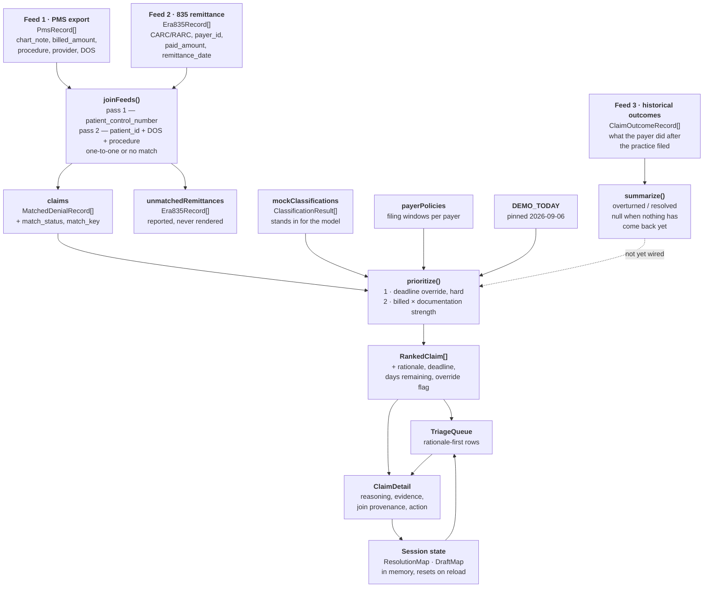

# System diagram — inputs and outputs

What the prototype actually does between the source data and the screen. Everything below
runs in the browser; there is no backend, no network call, and no persistence.

The design principle this diagram is meant to make checkable: **the model handles reading,
deterministic code handles ranking, and the human handles anything that commits the
practice's position to a payer.** Each stage below sits on one side of that line.

## Data flow

The dashed edge is the point: the outcomes feed exists and aggregates, but nothing it
produces reaches the ranking yet. Adding a payer track record term to `prioritize()` is
separate work, and the feed had to land first for there to be anything to learn from.

## Stage by stage

### `joinFeeds(pmsRecords, era835Records)`

| | |
| --- | --- |
| **In** | Two independent feeds. Neither alone can triage a denial: the PMS knows what was done clinically, the 835 knows what the payer decided. |
| **Out** | `{ claims, unmatchedRemittances }` |

Two passes, so the result never depends on feed order. Pass 1 matches on the
`patient_control_number` the payer echoes back. Pass 2 matches whatever is left on the
natural key of `patient_id + date_of_service + procedure_code`, and only when exactly one
record on each side carries that key — D4341 is billed per quadrant, so the natural key is
not unique in dentistry, and a wrong match that looks clean is worse than an honest gap.

Every claim carries how it was matched: `matched`, `fallback_matched`, or `unmatched`.
A fallback match is an assumption, so the UI flags it rather than passing it off as clean.

### `prioritize(claims)`

| | |
| --- | --- |
| **In** | Joined claims, plus classifications, payer policies, and the pinned date |
| **Out** | `RankedClaim[]` — sorted, each carrying its own rationale string |

No model involved. Two rules, in order:

1. **Deadline override, hard.** A filing window closing within `DEADLINE_OVERRIDE_DAYS`
   (14) floats the claim to the top regardless of dollar value — but only when a
   payer-facing filing is still live, meaning the recommended action is
   `proceed_to_drafting` or `route_to_human_review`. A claim headed for write-off is not
   racing anything, and showing urgency the ranking will not act on is noise dressed as rigour.
2. **Otherwise:** `billed_amount × documentation strength`, weighted
   `strong 1.0 · administrative 0.9 · ambiguous 0.6 · available_not_submitted 0.5 · weak 0.2`.
   Deliberately coarse — this is a sort key, not a prediction.

Deadlines are computed, not hardcoded: `remittance_date + payer.appeal_window_days`,
measured against `DEMO_TODAY`. Delta Regional allows 90 days and calls it an appeal;
Meridian allows 180 and takes corrected claims on a resubmission clock with no formal
appeal at all — so the UI labels them differently, because calling Meridian's window an
"appeal deadline" would misdescribe the payer's own policy.

Every claim exits with a **rationale string** rather than a score:
`"Strong documentation match · appeal deadline in 11 days · draft prepared"`. A single
opaque priority number would sort the list correctly and tell the biller nothing.

> A claim with no matching classification is dropped from the ranking entirely. With the
> seed data every claim has one, so this never fires in the demo.

### `summarize(outcomes)`

| | |
| --- | --- |
| **In** | `ClaimOutcomeRecord[]`, optionally narrowed by `byPayer` / `byCategory` / `byCarc` |
| **Out** | Counts plus `overturn_rate`, or `null` when nothing has come back yet |

Outcomes do not return on one clean feed, and the record shape is built around that. A
corrected claim resubmission is re-adjudicated and comes back on an 835 — the same channel
as the original denial. A formal appeal usually leaves EDI entirely, going out by portal or
mail with attachments the 837 handles poorly, and the determination returns as
correspondence.

The asymmetry is what forces the design. An **overturned** appeal moves money and generally
surfaces on a later remittance. An **upheld** appeal moves nothing and may produce no 835 at
all. A log fed only from remittance data would therefore see its wins and miss its losses,
and every rate computed from it would read high.

So `result` is not a binary. It is `pending → presumed_upheld → confirmed_*`, where
`presumed_upheld` is what a timeout produces after `PRESUMED_UPHELD_AFTER_DAYS` (60) and
stays correctable — payers reprocess late, and a biller can get a determination by phone.
Only the confirmed states are terminal. `outcome_source` records how each determination was
learned (`remittance_835`, `biller_confirmation`, `timeout_inference`), and
observed-versus-inferred is derived from it rather than stored beside it, so the two cannot
disagree.

`overturn_rate` is `null` rather than `0` when nothing has resolved. A payer nobody has
heard back from has an unknown rate, and reporting that as zero is the most damaging
available misreading of an empty sample.

The records are denormalized — payer, category, CARC and documentation strength are copied
onto each one — so aggregation never joins back to a claim. The claims in the PMS feed are
the live queue and are unresolved by definition; history describes earlier claims that have
left the working set. `claim_id` and `payer_claim_control_number` are there to match a
*future* remittance, not to look anything up today.

## Output surface — what each classification offers the user

| Action | Queue treatment | Detail screen offers | Resolves to |
| --- | --- | --- | --- |
| `proceed_to_drafting` | Ready for review, teal | Editable appeal draft; submit **disabled until the draft is opened** | `submitted` |
| `route_to_human_review` | Needs human review, amber, **heavier border and tinted field** | No draft written at all; a checklist of what a person must verify | nothing — the system will not close it |
| `approve_correction` | Correction ready, mint | Before/after field diff with its source of truth | `submitted` |
| `recommend_writeoff_or_addendum` | Recommend write-off, grey | Confirm write-off, or request a provider addendum | `written_off` |

The low-confidence claim is the one deliberate asymmetry: it gets *more* visual weight
than the confident rows, not less. "The system is not sure" is a first-class outcome here,
not a degraded version of a verdict.

## Real vs. mocked

| Piece | Status |
| --- | --- |
| Join logic | **Real** — two passes, ambiguity handling, provenance, covered by dev assertions |
| Prioritization and deadline math | **Real** — deterministic, fully inspectable |
| Payer policy table | **Real but tiny** — four payers, hand-authored, windows from 45 to 180 days |
| Outcome state machine and aggregation | **Real** — transitions enforced, rates degrade to `null` on an empty sample |
| Historical outcomes feed | **Mocked** — local TypeScript module, 24 filings across four payers |
| Denial classification | **Mocked** — fixed `ClassificationResult` per claim. The shape is the real contract; the values would come from a model reading the chart note |
| Appeal draft generation | **Mocked** — one static narrative. Editing it is real |
| Both claim source feeds | **Mocked** — local TypeScript modules, ten claims |

## What never happens

- No network request of any kind leaves the browser
- Nothing is written to a payer, a clearinghouse, or a PMS
- No persistence: `ResolutionMap` and `DraftMap` live in React state and reset on reload
- No action fires without an explicit click — including submission, which stays disabled
  until the draft has been read

See [`../README.md`](../README.md) for the demo script and how to run it.
